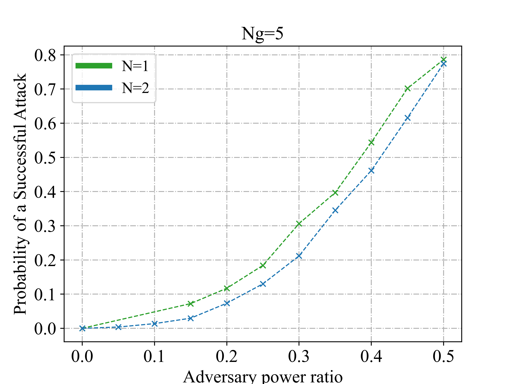
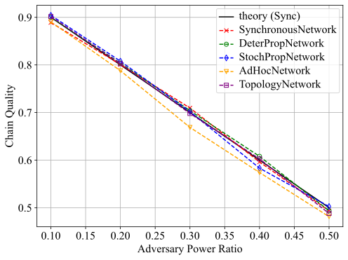
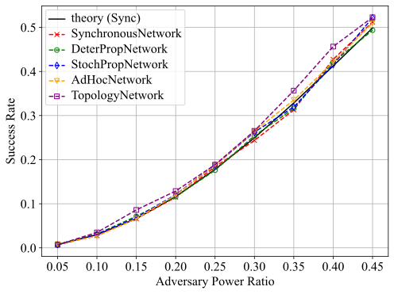
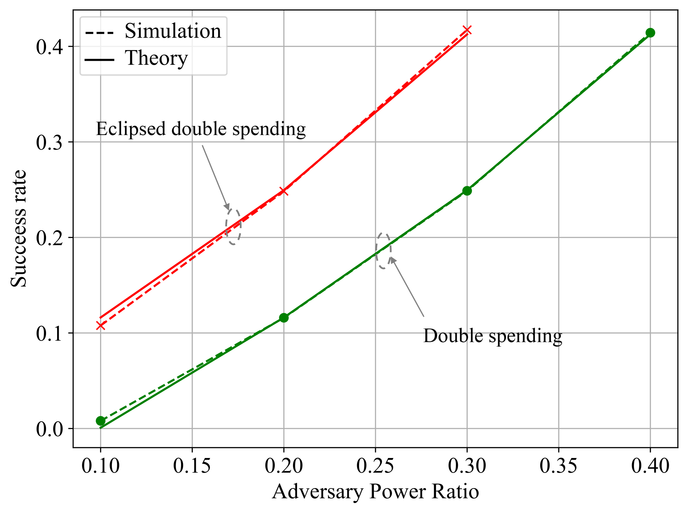

# Simulation Examples
In this document, we perform experiments with ChainXim, depict the results, and compare some of them with theoretical values.

### Relationship between the Number of Miners and Block Time in Synchronous Network
Synchronous Network: X-axis represents the number of miners, Y-axis represents the block time.

**Parameter settings:**

* Simulation rounds: 200000 rounds * 1 time

* Number of miners: 10-80

* Consensus type: PoW

* Difficulty: 0000FF...

* q_ave = 10

* Network parameters: SynchronousNetwork

{: style="height: 460px"}

### Double Spending Attack Success Rate
**Parameter settings:**

* Simulation rounds: 1200000 rounds * 1 time

* Number of miners: 40

* Consensus type: PoW

* Difficulty: 000FFF...

* q_ave = 1

* Network parameters: default for all four network types

{: style="height: 460px"}

---

**Advanced Performance Display**

### Fork Rate, Stale Block Rate, Throughput, and Consistency under Different Maximum Delays in Various Networks

- Rounds: 100000
- Number of miners: 100
- Consensus type: PoW
- q_ave: 10
- Difficulty: 0002FF...
- Network types: SynchronousNetwork and BoundedDelayNetwork
- Network parameters: rcvprob_start=rcvprob_inc=1/maximum rounds

---
Fork rate/Stale block rate and throughput variation with maximum propagation delay

{: style="height: 460px"}

---
Consistency metrics variation with maximum propagation delay

{: style="height: 460px"}

In the figure, Common Prefix[0], [1], [2] represent the first three components of the common prefix PDF, where the ordinal number represents the difference between the common prefix and the main chain length (see the "Simulator Output" section for details).

### Common Prefix Property of Blockchain under Topology Network

- Rounds: 16189
- Number of miners: 10
- Consensus type: PoW
- Difficulty: 000FFF...
- Network type: TopologyNetwork
- Network parameters: gen_net_approach=adj; bandwidth_honest=0.5

At the end of each round, the height difference of the local chains of all nodes relative to the common prefix and its impact on the Common Prefix PDF are shown in the figure below. The time axis below is the round in which the chain tail switch event occurred, the upper x-axis is the block height/common prefix followed by the block length (suffix length), and the y-axis is the miner ID. The heat value in the figure indicates the cumulative number of times each miner's local chain tail reaches the suffix length relative to the common prefix. BXX in the figure refers to the block number, representing the state of the miner's local chain tail in the current round, and the lower x-axis indicates the height of these blocks. Click Play to start the animation, where you can observe the block being generated to extend the common prefix, then propagating to other miners, and finally causing the common prefix height to increase by 1.

<iframe
 height=850px
 width=850px
 src="/chainxim-documentation/doc/cp_pdf.html"  
 frameborder=0 
 display:block>
 </iframe>

### Fork Rate, Stale Block Rate, Throughput, and Consistency under Different Block Sizes

- Rounds: 500000
- Number of repetitions per point on the curve: 5
- Number of miners: 20
- Consensus type: PoW
- Difficulty: 0000FF...
- Network type: TopologyNetwork
- Network parameters: TTL=500; gen_net_approach=rand; ave_degree=8; bandwidth_honest=0.5; bandwidth_adv=5; block_prop_times_statistic=[0.1, 0.2, 0.4, 0.5, 0.6, 0.7, 0.8, 0.9, 1.0]

---
Fork rate/Stale block rate and throughput variation with block size
{: style="height: 460px"}

---
Consistency metrics variation with block size
{: style="height: 460px"}

In the figure, Common Prefix[0], [1], [2] represent the first three components of the common prefix PDF, where the ordinal number represents the difference between the common prefix and the main chain length (see the "Simulator Output" section for details).
### Variation of Propagation Delay with Block Size

- Rounds: 100000
- Number of miners: 100
- Consensus type: PoW
- q_ave: 10
- Difficulty: 00008F...
- Network type: TopologyNetwork
- Network parameters: TTL=500; gen_net_approach=rand; ave_degree=8; bandwidth_honest=0.5; bandwidth_adv=5; block_prop_times_statistic=[0.1, 0.2, 0.4, 0.5, 0.6, 0.7, 0.8, 0.9, 1.0]

---
Variation of propagation delay and 90% effective throughput with block size

{: style="height: 460px"}

**Note: X% effective throughput = block size / (X% block propagation delay)**

### Attacker's Block Proportion under Different Attack Vectors

#### 1. Honest Mining Attack

{: style="height: 460px"}

##### **Impact of Four Different Networks on Honest Mining Attack**
Definition of a successful attack: The attacker produces a block and is accepted by the network.

**Parameter settings:**

* Rounds: 1000000 rounds

* Number of miners: 20

* Consensus type: PoW

* Difficulty: 000FFF...

* q_ave = 1

* Network parameters: `blocksize=4`, the bandwidth of the edges in `TopologyNetwork` is `2MB/round` with dynamic topology enabled. Other network parameters are set to default values.

---
#### 2. Selfish Mining Attack
##### **Impact of Different Networks on Selfish Mining Attack**

{: style="height: 460px"}

The vertical axis represents the chain quality metric, i.e., the proportion of blocks produced by the attacker in the main chain

**Parameter settings:**

* Simulation rounds: 300000 rounds

* Number of miners: 20

* Consensus type: PoW

* Difficulty: 000FFF...

* q_ave = 1

* Network parameters: identical to that of honest mining

The theoretical curve in the figure is obtained by the following formula:

$$ R=\frac{4\alpha^{2}(1-\alpha)^{2}-\alpha^{3}}{1-\alpha(1+(2-\alpha)\alpha)} $$

---
#### 3. Double Spending Attack

##### **Impact of Different Networks on Double Spending Attack**

{: style="height: 460px"}

**Parameter settings:**

* Simulation rounds: 3000000 rounds

* Number of miners: 20

* Consensus type: PoW

* Difficulty: 000FFF...

* q_ave = 1

* Network parameters: identical to that of honest mining

---
##### **Impact of Different Strategies on Double Spending Attack and Theoretical Comparison**

{: style="height: 460px"}

**Parameter settings:**

* Simulation rounds: 3000000 rounds

* Number of miners: 20

* Consensus type: PoW

* Difficulty: 000FFF...

* q_ave = 1

* Network parameters: SynchronousNetwork

The theoretical curve in the figure is obtained by the following formula:

$$P(N,N_g,\beta)=1-\sum_{n=0}^{N}\begin{pmatrix}n+N-1\\
n
\end{pmatrix}\left(\frac{1}{1+\beta}\right)^{N}\left(\frac{\beta}{1+\beta}\right)^{n}\left(\frac{1-\beta^{N-n+1}}{1-\beta^{Ng+1}}\right)$$

$N$ is the number of blocks the attacker waits for confirmation, i.e., the attacker will wait for the honest chain to grow by $N$ blocks before deciding whether to publish.
$N_g$ indicates that the attacker abandons the current attack when it is $N_g$ blocks behind the honest chain.
$\beta$ is the ratio of the attacker's hash power to that of the honest miners, $0\leqslant\beta\leqslant1$.

---

#### 4. Eclipsed Double Spending

##### **Double Spending Attack under Eclipse Attack**

{: style="height: 460px"}

**Parameter settings:**

* Simulation rounds: 1000000 rounds

* Number of miners: 10

* Consensus type: PoW

* Difficulty: 000FFF...

* q_ave = 1

* Network type: TopologyNetwork

* Block size: 0 MB

* Network Parameters: Use the following topology:

    

    The eclipse target is set to node 0, and attackers are designated as nodes 1, 2, 3, 4, etc. In short, node 0 is only connected to attackers, while all other nodes are fully connected.
        

