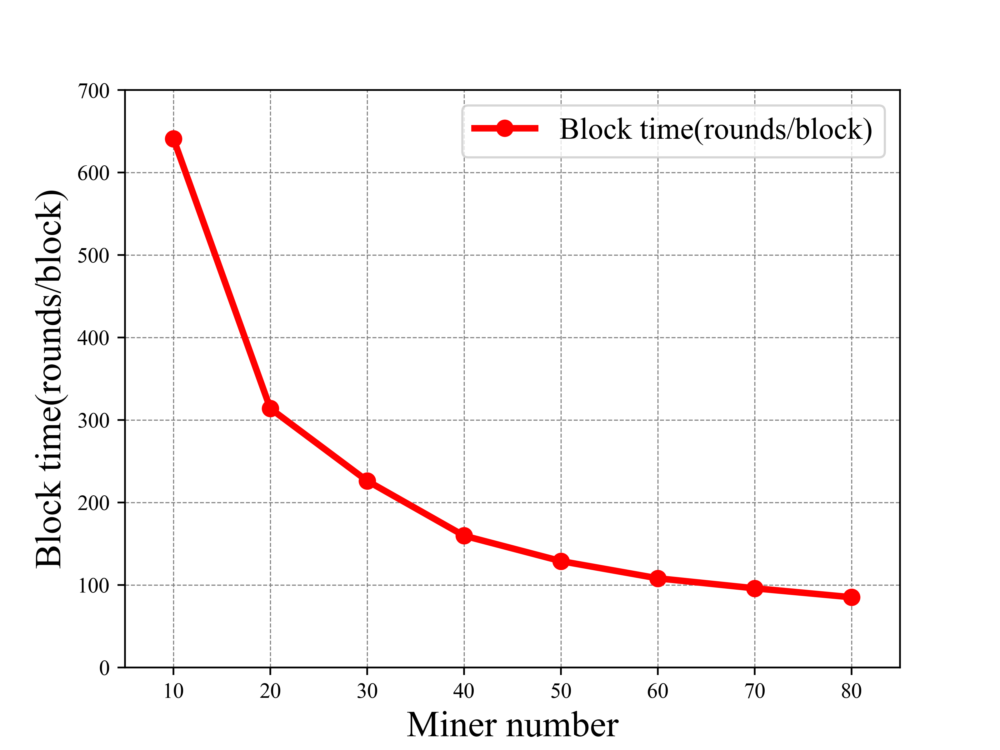

# 仿真实例 Simulation Examples
在本文档中，我们使用ChainXim进行实验，展示结果，并将其中一些结果与理论值进行比较。

### 同步网络中矿工数量与出块时间的关系
同步网络 横坐标矿工数目 纵坐标出块时间

**参数设置如下：**

* 仿真次数：200000轮*1次

* 矿工数：10-80

* 共识类型：PoW

* 难度：0000FF...

* q_ave = 10

* 网络参数：SynchronousNetwork

{: style="height: 460px"}

### 双花攻击成功率
**参数设置如下：**

* 仿真次数：1200000轮*1次

* 矿工数：40

* 共识类型：PoW

* 难度：000FFF...

* q_ave = 1

* 网络参数：四种网络参数均为默认

{: style="height: 460px"}

---

**进阶性能展示**

### 不同网络最大时延下的分叉率、孤块率、吞吐量与一致性
* 轮数：100000

* 矿工数：100

* 共识类型：PoW

* q_ave:10

* 难度：0002FF...

* 网络类型：SynchronousNetwork和BoundedDelayNetwork

* 网络参数：rcvprob_start=rcvprob_inc=1/最大轮数

---
分叉率/孤块率与吞吐量随最大传播时延的变化示意图

{: style="height: 460px"}

---
一致性指标随最大传播时延的变化示意图

{: style="height: 460px"}

图中，Common Prefix[0]、[1]、[2]分别代表共同前缀PDF的前三个分量,其中序数代表共同前缀与主链长度的差值（详见“仿真器输出”一节）。

### 拓扑网络下区块链的共同前缀性质

- 轮数：16189
- 矿工数：10
- 共识类型：PoW
- 难度：000FFF...
- 网络类型：TopologyNetwork
- 网络参数：gen_net_approach=adj；gen_net_approach=adj；bandwidth_honest=0.5

每轮结束时，所有节点的本地链相对共同前缀的高度差以及其对Common Prefix PDF的影响如下图所示。下方时间轴是发生链尾切换事件的轮次，上x轴是区块高度/common prefix后的区块长度（suffix length），y轴是矿工ID。图中的热度值指代的是每个矿工本地链链尾与共同前缀的距离达到Suffix Length的累积次数。图中BXX指代区块编号，代表矿工在当前轮次本地链链尾的状态，下x轴指代这些区块所在的高度。点击Play开始播放动画，可以观察到区块在共同前缀的下一高度产生，然后扩散到其他矿工，最后导致共同前缀高度+1。

<iframe
 height=850px
 width=850px
 src="/chainxim-documentation/doc/cp_pdf.html"  
 frameborder=0 
 display:block>
 </iframe>

### 不同区块大小下的分叉率、孤块率、吞吐量与一致性
- 轮数：500000
- 曲线上单点重复次数：5
- 矿工数：20
- 共识类型：PoW
- 难度：0000FF...
- 网络类型：TopologyNetwork
- 网络参数：TTL=500；gen_net_approach=rand；ave_degree=8；bandwidth_honest=0.5; bandwidth_adv=5；block_prop_times_statistic=[0.1, 0.2, 0.4, 0.5, 0.6, 0.7, 0.8, 0.9, 1.0]

---
分叉率/孤块率与吞吐量随区块大小的变化示意图
{: style="height: 460px"}

---
一致性指标随区块大小的变化示意图
{: style="height: 460px"}

图中，Common Prefix[0]、[1]、[2]分别代表共同前缀PDF的前三个分量，其中序数代表共同前缀与主链长度的差值（详见“仿真器输出”一节）。

### 传播时延随区块大小的变化
- 轮数：100000

- 矿工数：100
- 共识类型：PoW
- q_ave:10
- 难度：00008F...
- 网络类型：TopologyNetwork
- 网络参数：TTL=500；gen_net_approach=rand；ave_degree=8；bandwidth_honest=0.5; bandwidth_adv=5；block_prop_times_statistic=[0.1, 0.2, 0.4, 0.5, 0.6, 0.7, 0.8, 0.9, 1.0]

---
传播时延与90%有效吞吐量随区块大小的变化示意图

{: style="height: 460px"}

**注：X%有效吞吐量=区块大小/(X%区块传播时延)**

### 不同攻击向量下的攻击者出块占比示意图

#### 1. 算力攻击（honest mining）

{: style="height: 460px"}

##### **四种不同网络对算力攻击的影响示意图**
一次攻击成功的定义：攻击者产出区块，并被网络接受。

**参数设置如下：**

* 轮数：1000000轮

* 矿工数：20

* 共识类型：PoW

* 难度：000FFF...

* q_ave = 1

* 网络参数：
    blocksize=4 TopologyNetwork中带宽均为2 且 开启动态拓扑
    其余网络参数为默认参数

---
#### 2. 区块截留攻击（selfish mining）
##### **不同网络对区块截留攻击的影响示意图**

{: style="height: 460px"}

纵坐标为链质量指标，即最终攻击者产出区块在主链中的占比。

**参数设置如下：**

- 仿真次数：300000轮
- 矿工数：20
- 共识类型：PoW
- 难度：000FFF...
- q_ave = 1
- 网络参数：与算力攻击一样

图中的理论曲线由以下公式得到：

$$ R=\frac{4\alpha^{2}(1-\alpha)^{2}-\alpha^{3}}{1-\alpha(1+(2-\alpha)\alpha)} $$

---
#### 3. 双花攻击（double spending）

##### **不同网络对双花攻击的影响示意图**

{: style="height: 460px"}

**参数设置如下：**

- 仿真次数：3000000轮
- 矿工数：20
- 共识类型：PoW
- 难度：000FFF...
- q_ave = 1
- 网络参数：与算力攻击一样

---
##### **不同策略对双花攻击的影响与理论对比示意图**

{: style="height: 460px"}

**参数设置如下：**

- 仿真次数：3000000轮
- 矿工数：20
- 共识类型：PoW
- 难度：000FFF...
- q_ave = 1
- 网络参数：SynchronousNetwork

图中的理论曲线由以下公式得到：

$$P(N,N_g,\beta)=1-\sum_{n=0}^{N}\begin{pmatrix}n+N-1\\
n
\end{pmatrix}\left(\frac{1}{1+\beta}\right)^{N}\left(\frac{\beta}{1+\beta}\right)^{n}\left(\frac{1-\beta^{N-n+1}}{1-\beta^{Ng+1}}\right)$$

$N$为攻击者等待确认区块的数量，即攻击者会等待诚实链高度增长$N$个区块后才会选择发布与否。
$N_g$表示当攻击者落后诚实链$N_g$个区块时放弃当前攻击。
$\beta$为攻击者与诚实矿工算力之比，$0\leqslant\beta\leqslant1$。

---

#### 4. 日蚀攻击（eclipsed double spending）

##### **受日蚀攻击影响下的双花攻击示意图**

{: style="height: 460px"}

**参数设置如下：**

- 仿真次数：1000000轮
- 矿工数：10
- 共识类型：PoW
- 难度：000FFF...
- q_ave = 1
- 网络类型：TopologyNetwork
- 区块大小：0MB
- 网络参数：使用如下拓扑

  

  日蚀目标设置为0号节点，攻击者设置为1,2,3,4等。简言之，0号节点只能与攻击者链接，其余节点是全连接。

